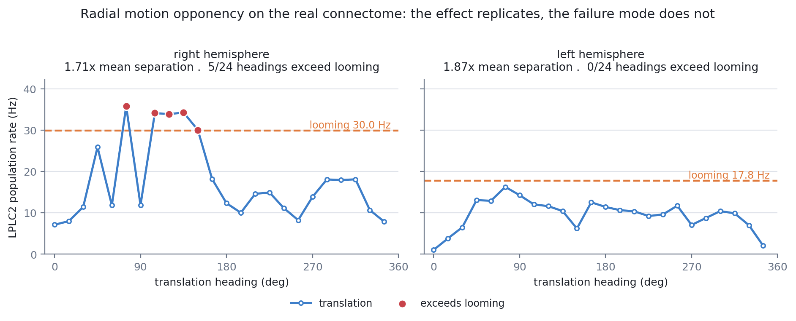
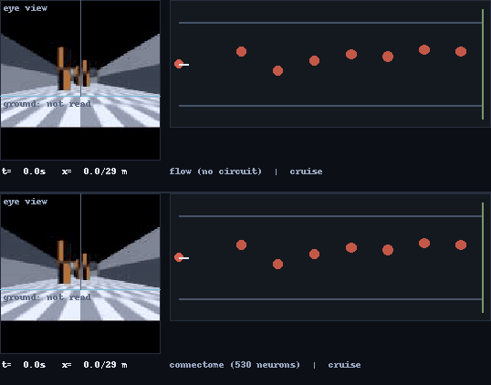
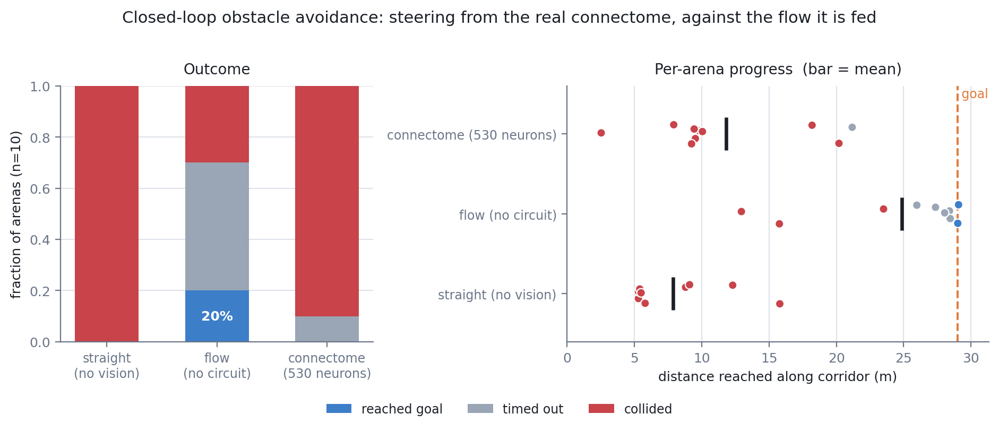
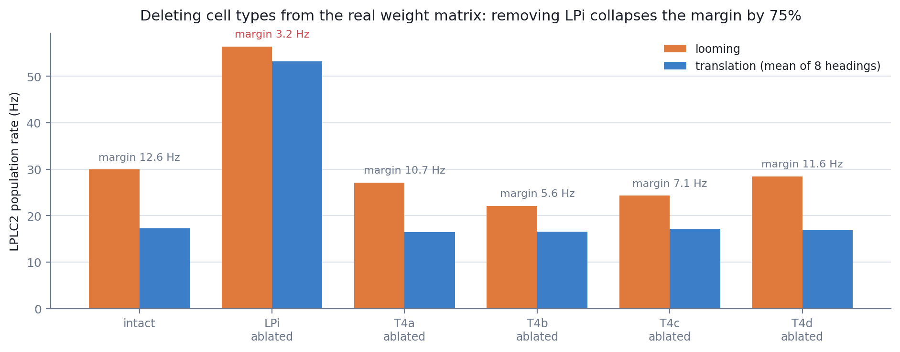
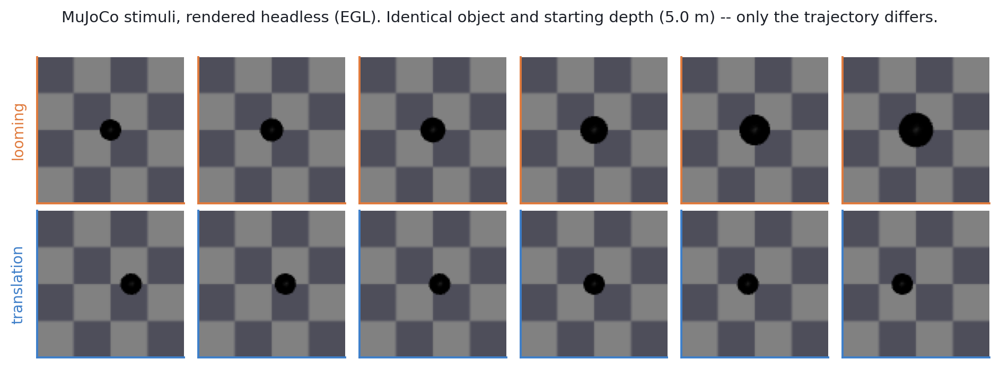

# FlyGuard

**A collision detector with zero trained parameters, built from the wiring diagram of a fly.**

Every synaptic weight in the detector is a real synapse count from the FlyWire FAFB v783
connectome. Nothing is fit, nothing is learned. The question this repo actually answers is
narrower and more interesting than "does it work":

> *How much of a textbook neural mechanism survives when you replace the idealized version,
> step by step, with the measured anatomy?*

Short answer: **it degrades, monotonically, and the reasons are measurable.**

> **Not the Google/DeepMind fly-brain project.** If you've seen the 2026 headlines about a
> connectome-derived fly brain playing Doom and Minecraft, that's a different, much larger
> effort (a whole-CNS connectome plus a graph model trained around it by reinforcement
> learning -- see [Citation](#citation)). This repo shares a data source in spirit -- a real
> connectome, not a trained brain -- but trains nothing, anywhere, ever. The question it
> asks is the opposite kind: not "can a connectome control a body" but "how much of one
> specific textbook mechanism survives once the idealized model is replaced by the measured
> wiring." Smaller claim, zero learned parameters, different point.



---

## Use it on a robot

```bash
pip install -e .          # numpy, scipy, pandas. No GPU, no simulator, no OpenCV.
```

**1. Calibrate on your camera.** Four constants depend on your field of view,
resolution, scene texture and speed, so they are measured, never guessed. Record two
short clips while driving forward -- one through open space, one toward real obstacles --
and hand them over:

```bash
flyguard-calibrate --clear clear.npy --obstacle obstacle.npy \
    --columns column_assignment.csv --out my_camera.json
```

It prints what it measured and warns when the numbers are arithmetically fine but
behaviourally useless, which is the failure mode that actually happens.

**2. Drive it.** Push frames, get commands:

```python
from flyguard import FlyGuardPilot, Calibration

pilot = FlyGuardPilot("column_assignment.csv", Calibration.load("my_camera.json"))

while camera.is_open():
    cmd = pilot.step(camera.read())        # any HxW or HxWx3 uint8 array
    base.drive(cmd.v, cmd.omega)           # cmd.estop is the Giant Fiber
```

**Or on ROS2**, against any `sensor_msgs/Image` -- USB camera, depth camera's RGB stream,
Gazebo plugin, rosbag:

```bash
ros2 run flyguard_ros2 camera_node --ros-args \
    -p image_topic:=/camera/image_raw \
    -p columns_csv:=column_assignment.csv \
    -p calibration:=my_camera.json
```

Publishes `/cmd_vel`, plus `flyguard/estop`, `flyguard/lplc2_rate`, `flyguard/turn` and
`flyguard/dropped_frames`. No cv_bridge, so no OpenCV and no matching ROS2 build needed.

### Three things to know before it moves

**`estop` is anatomy. `omega` is not.** This repo checked the extracted subnetwork rather
than assuming: LPLC2 and LC4 project onto DNp01/DNp02/DNp04/DNp11 -- the Giant Fiber escape
pathway -- with **zero** direct edges onto DNa01, DNa02 or MDN, the descending neurons that
steer and reverse. The measured circuit can say *stop*. It cannot say *turn left*. The turn
signal is an engineering addition layered on top, isolated in one function
(`runtime.steering.bilateral_turn`) so it is easy to find and easy to criticise. Do not
describe a robot running this as "steered by the connectome".

**Run the baseline.** `-p backend:=flow` keeps every gain, normalisation and calibration
constant identical and removes only the 530 neurons. On the corridor benchmark below the
circuit *did not beat it*. Whatever you measure on your own robot, measure it against this.

**The data is non-commercial.** The code is MIT; `data/looming.npz` is derived from FlyWire
and carries CC BY-NC-SA. See [LICENSE](LICENSE). The `flow` backend uses no connectome data
and is unencumbered.

### Timing

One CPU core, no GPU, 10 Hz tick (100 ms budget) -- `python -m flyguard.bench_runtime`:

| resolution | perception | 530-neuron circuit | total | vs budget |
|---|---|---|---|---|
| 64 px | 7.2 ms | 67.6 ms | 70.2 ms | 1.43x |
| 96 px | 9.5 ms | 66.9 ms | 72.9 ms | 1.37x |
| 128 px | 13.4 ms | 67.9 ms | 77.9 ms | 1.28x |

The two stages scale differently, and that decides how you fix a loop that is too slow.
**Perception scales with pixel count; the circuit does not** -- it scales with simulated time
and neuron count, and costs the same whether the camera is 64x64 or 4K. So lower the
resolution first; it buys little, because the circuit dominates at every size. To go faster
than ~13 Hz you have to shorten the tick, which shortens the LIF window the rates are
measured over.

The node drops frames rather than queueing them: a queue grows without bound and steers on
stale pixels. `flyguard/dropped_frames` makes a too-fast camera visible instead of silent.

---

## The result

*Drosophila* LPLC2 is a looming detector. Klapoetke et al. (2017) explain its selectivity
with **radial motion opponency**: four dendritic arms, one per lobula plate layer, each
receiving outward-tuned excitation from T4/T5 and inward-tuned inhibition from LPi.
Expansion agrees with all four arms; uniform translation drives them into conflict and
cancels.

I implemented that mechanism at three levels of anatomical realism and measured the same
looming-vs-translation discrimination at each:

| Level | Weights | Flow input | Discrimination |
|---|---|---|---|
| 1. idealized four-arm model | balanced 1:1 | synthetic, full-field | **exact** -- analytically zero for translation at *every* heading |
| 2. real connectome | anatomical | synthetic, full-field | **1.71x / 1.87x** separation; 76% / 92% accuracy (right / left) |
| 3. real connectome | anatomical | estimated from rendered pixels | **1.15x** separation; 60% accuracy |

Two measured causes for the fall-off, not hand-waving:

- **The wiring is not balanced.** Summed weight onto LPLC2 is **3.34:1 excitation-dominant**
  (T4/T5 -> LPLC2: +37,181 over 5,795 edges; LPi -> LPLC2: -11,124 over 989 edges). Perfect
  cancellation is a property of the *abstraction*, not the anatomy. Curiously LPi synapses
  are individually far stronger (51.98 vs 7.69 per neuron) -- there are just ~22.6x fewer of them.
- **Real flow is sparse and local.** The synthetic fields describe whole-field radial flow;
  a discrete approaching object only generates flow near its own silhouette boundary.

The honest assessment, stated up front: this is a strong portfolio repo, not publishable
science. The direction convention is unvalidated and load-bearing, there is no comparison
against Klapoetke's recordings, and a point-neuron LIF cannot express the four-arm dendritic
geometry the mechanism depends on. [Limitations](#limitations) treats all three.

---

## Closing the loop: can it actually avoid obstacles?

Everything above is open loop -- the detector watches, and its opinion changes nothing.
So I put it on a robot in a 3D world and let it steer.

An agent drives down a randomised corridor of textured pillars. Each tick it renders its
own eye view, estimates optical flow, feeds each half of the visual field into **that
hemisphere's** real T4/T5 columns, simulates the real 530-neuron circuit, and steers.



*The result, animated. Both strips are **the same arena, the same gains, the same
calibration** -- the only difference is whether 530 real neurons sit between the optic flow
and the steering command. The flow baseline (top) threads the corridor and reaches the goal;
the connectome (bottom) hits the second pillar at 7.4 m and the strip freezes on the
collision. Left of each strip is the agent's own 128x128 eye view, with the cyan line
marking where the encoder stops reading -- everything below it is ground, which carries no
obstacle signal. The marker turns red when DNp01 fires. This is arena 9 of 10 -- one arena
cannot stand in for the benchmark, and the per-arena spread is in the chart below.*

These are the benchmark trials themselves rather than re-enactments: the recorder drives
`avoid.run_trial` through a frame-capture hook instead of reimplementing the loop. For an
interactive version of the connectome run with a scrubber, open
[`docs/corridor_run.html`](docs/corridor_run.html) in a browser -- one self-contained file
with the recording embedded, no server and no network.

Over 10 arenas, 7 obstacles each, nothing trained:



| Controller | Collisions | Goals | Mean distance | E-stop ticks |
|---|---:|---:|---:|---:|
| straight (no vision) | 100% | 0% | 7.9 / 29 m | 0 |
| **flow** (same eyes, no circuit) | **30%** | **20%** | **24.9 / 29 m** | 28 |
| **connectome** (530 neurons) | 90% | 0% | 11.8 / 29 m | 49 |

Both vision controllers beat the blind baseline. **The connectome trails the flow signal
it is fed, badly** -- 90% collisions against 30%, less than half the distance -- and that
is what the middle row exists to detect. Both share identical gains, normalisation and
calibration; the only difference is whether 530 real neurons sit in between.

*(`flow`'s numbers moved from an earlier 40%/10%/23.2m after the steering-law addition
described further down (the wall/obstacle split just below, and the turn-signal-accumulator
note under Limitations): it fixed one arena outright, from an obstacle collision straight
through to the goal, and left every other arena unchanged. `connectome`'s aggregate row is
unchanged to three significant figures, though not because nothing moved underneath it --
one arena improved, one regressed, by coincidence they cancel exactly.)*

**But "collision rate" was hiding the actual failure.** Classifying *what* each trial hit
(`arena.collision_kind`) splits it cleanly:

| Controller | hit a wall | hit an obstacle |
|---|---:|---:|
| straight (no vision) | 0 | **10** |
| flow | 1 | 2 |
| **connectome** | **7** | **2** |

The blind baseline does the expected thing: it drives into pillars. The connectome
controller almost never hits a pillar -- it drives into the **corridor wall**, 7 times out
of 9. The corridor is 8 m wide and every arena is passable with 1.6 m of clearance.

The trajectories say why. Final headings cluster at exactly **+/-27.5 deg** -- one saccade is
1.6 rad/s x 0.3 s = 27.5 deg -- and at **-80 deg**, which is the heading clamp. So the agent either
commits a single turn and then holds it, or turns the same way repeatedly until it runs out
of heading, and in both cases slides into a wall it never turns away from. All seven of the
wall strikes are on the same side. That is a **systematic steering bias**, not a failure to
see obstacles, and it is not removed by the measured `turn_offset` -- nor, it turns out, by
the turn-signal accumulator below, which changed *which* two arenas collide with what
without changing the bias itself.

Two known properties of the design meet here. A bilateral difference is blind to anything
symmetric about the midline, so a wall approached at a shallow angle produces little signal;
and the escape channel that exists to cover exactly that case is saturated (below). `python
-m flyguard.diagnose_trial --arena 9` replays a single trial and prints the turn signal
against its own threshold every tick, which is how this was found.

**What that trace actually showed, on arena 9, was a third failure shape.** The turn signal
stayed correctly signed away from the wall for the whole 8-second approach, but sat just
under the calibrated threshold on 80 of 82 ticks -- not absent, not wrong-sign, just
*chronically weak*. `SaccadicSteering` now carries a second, independent trigger for this:
an exponential moving average of the same signal, calibrated the same way (a high percentile
of its own noise floor on an empty corridor) but on the smoothed trace rather than any single
tick, since a real sustained bias survives smoothing far better than tick-to-tick noise does.
It's additive -- an isolated strong obstacle still fires the instant threshold exactly as
before -- and it defaults to off, so nothing changes unless it's calibrated in.

**Re-running arena 9 with it: the mechanism fires as designed and the trial still
collides**, later rather than never (x=7.9 m instead of 7.4 m) -- the same rightward bias
reasserts itself a couple of seconds after each correction. Across all 10 arenas the effect
is genuinely mixed, not a fix: one arena that used to hit the wall now hits an obstacle
further down the corridor instead (net collision either way), and one arena that used to
finish cleanly now collides with an obstacle it didn't before -- they cancel, which is why
the connectome row in the headline table above didn't move. `flow`'s row did move, from one
clean rescue (an obstacle collision that now reaches the goal outright). Reported as what it
is: the addition changes individual trajectories in both directions without reducing the
connectome controller's aggregate collision rate on this benchmark.

> **Steering is not in the connectome, and this repo is the reason I know that.** LPLC2/LC4
> reach DNp01 and have *zero* edges onto the steering neurons. So the turn command compares
> the two hemispheres' LPLC2 rates and turns away from the louder one. The ingredients are
> real -- two independently reconstructed optic lobes, each with its own DNp01 -- but **the
> comparison operator is mine**, flagged like the direction convention. This is not
> "the connectome steers the robot".

**Ablate the escape channel and the result gets sharper, not kinder.** Deleting it -- the
same move as the cell-type ablations above:

| | with escape | without escape |
|---|---|---|
| flow | 30% coll, 20% goal, 24.9 m | 40% coll, **60% goal**, 24.2 m |
| connectome | 90% coll, 0% goal, 11.8 m | 100% coll, 0% goal, **10.1 m** |
| *straight, for reference* | *100% coll, 0% goal, 7.9 m* | |

Two things fall out, and neither is kind to the circuit.

**Without the escape channel the connectome controller (10.1 m) is no longer
indistinguishable from driving blind (7.9 m), and that claim needs a caveat rather than a
clean update.** This used to read 7.8 m -- flatly equal to blind -- before the turn-signal
accumulator above gave the steering-only circuit enough extra correction to pull ahead.
Whether a 2.2 m gap is real or arena luck is exactly what this benchmark's own stated
limitation (n=10, single-arena spreads of +/-14-21 m measured elsewhere in this file) says
we cannot currently tell apart. Read it as: *steering's contribution is small and possibly
zero*, not *provably zero* -- the stronger claim this section used to make was true of the
old steering law and is not a safe read of the current one without more arenas.

**Meanwhile the escape channel still actively costs the flow controller.** Removing it
takes flow from 20% to **60%** goals reached, and *lowers* the collision rate too (40% ->
30% with escape, i.e. escape trades a better collision rate for far fewer finished runs) --
the braking is stopping a controller that would otherwise reach the goal more often, at
the cost of a somewhat higher collision rate when it doesn't. So the one channel the
anatomy genuinely licenses is, as modelled here, a real trade rather than a pure loss --
still not a flattering one.

**Why: DNp01 is saturated.** With 2 DNp01 neurons, a 100 ms tick and a 2.2 ms refractory
period the ceiling is ~90 spikes. Swept directly, it sits at 84-87 across the *entire*
drive range at every base rate from 20 to 250 Hz, while LPLC2 varies properly over
110-273 Hz. That isn't a tuning problem -- DNp01 receives 231 edges carrying sumw 4257
against a ~26-synapse threshold. **In a point-neuron model the Giant Fiber is a binary
alarm: it can encode "something", never "how close."** That's the limitation in
the point-neuron model's limitation appearing as behaviour rather than as a caveat, and it makes a
falsifiable prediction: restore dynamic range at that junction -- compartmentalisation,
adaptation, synaptic depression -- and most of the gap should close.

Four more things the closed loop forced into the open, each measured rather than tuned,
and each regenerated by `python -m flyguard.validate_arena`:

- **Self-motion flow is the enemy, and bilateral cancellation is the defence.** Moving
  forward makes the whole world expand. The obstacle lifts the absolute drive 2.02x, but
  the left/right difference swings +/-0.46 -- because self-motion flow is roughly symmetric
  and cancels in a difference, while an obstacle doesn't.
- **Continuous steering cannot work.** Rotating the camera floods the field with
  rotational flow and pins both hemifields. Flies solve this structurally, with saccades;
  implementing that -- *including suppression through the post-saccade settling window* --
  is what produced the first successful runs.
- **Lucas-Kanade inverts the signal at short range.** Close surfaces move too fast for the
  differential solver, so the estimate collapses toward zero and a wall about to be
  scraped reads as *emptier* than open corridor. Fixed with a coarse-to-fine pyramid.
  A sign error is invisible in aggregate statistics, so there's now a permanent sign check.
- **A frontal obstacle is invisible to a bilateral difference.** By symmetry it drives both
  sides equally. That's exactly the case the Giant Fiber escape exists for -- which is why
  the saturated e-stop above actually costs something.

**A static measurement predicted the wrong sign, twice over.** Excluding the ground from
the encoder's input is worth about 9 m of progress for the flow controller and over 1 m for
the connectome: re-running the whole benchmark under both bands gives

| row band | flow | connectome |
|---|---|---|
| upper 60% (ground masked, default) | 30% coll, **24.9 m** | 90% coll, 11.8 m |
| full frame | 60% coll, 15.7 m | 90% coll, 10.5 m |

yet the *static* signal-to-noise measurement ranks the full frame **better** (6.0 vs 4.0).
The ground genuinely carries no obstacle signal (SNR 0.7), but it is densely textured and
flows consistently, which stabilises the denominator of the contrast-normalised ratio --
so it helps as a reference even though it carries nothing itself.

An earlier version of that SNR metric divided by the empty-corridor turn's *mean* (a bias
estimate) rather than its spread and reported the opposite static ranking, so this
parameter has now been wrong in both directions. The conclusion that survives is about
method, not about the band: **an open-loop signal statistic did not predict closed-loop
behaviour here, and the only way to find that out was to close the loop.**

---

## What's actually in the wiring

Verified directly against the extracted subnetwork, not assumed:

| Projection | Edges | Excitatory sumw | Inhibitory sumw |
|---|---:|---:|---:|
| T4/T5 -> LPLC2 | 5,795 | +37,181 | -838 |
| LPi -> LPLC2 | 989 | 0 | -11,124 |

T4/T5 is 98% excitatory, LPi 100% inhibitory -- exactly the roles the mechanism assigns.
(The 2% contamination is consistent with the ~87% accuracy of the neurotransmitter classifier.)

**The escape pathway is narrower than the robot analogy suggests.** LPLC2/LC4 project directly
and purely excitatorily onto DNp01 (the Giant Fiber -- 231 edges, sumw 4,257), DNp02, DNp04 and
DNp11, and have **zero** direct edges onto DNa01, DNa02 or MDN, the steering and reverse-walking
descending neurons. This is a dedicated fast reflex, not an input to steering. The ROS2 node
therefore commands *stop*, not *turn* -- because that's what's wired.

**A negative result, kept.** This project started on the hypothesis that LC4 and LPLC2
mutually inhibit. They don't: 1 edge LC4->LPLC2, 64 edges LPLC2->LC4, both purely excitatory,
zero inhibitory weight either direction. They're parallel pathways. The data killed the
hypothesis and the hypothesis was mine, so it's recorded rather than quietly dropped.

---

## Ablations

Delete a cell type from the real weight matrix (row and column zeroed) and re-measure:



Removing LPi collapses the discrimination margin by **75%** (12.6 -> 3.2 Hz) -- the detector
starts firing at everything, as the mechanism predicts. But the real circuit shows something
the idealized model *cannot*: the looming response nearly doubles too (30.0 -> 56.4 Hz),
because real LPi carries tonic inhibition even during pure outward flow.

Individual T4/T5 subtype ablations degrade the response roughly in proportion to population
size (T4d, 122 neurons, barely matters; T4c, 871, costs 19%) -- but discrimination survives
every single one. The mechanism is population-level and redundant across arms.

---

## Stimuli and baselines



Two conventional detectors run on the same rendered frames, for honest comparison:

| Detector | Accuracy | Input | Training data |
|---|---:|---|---|
| Lee's tau (time-to-contact) | 1.000 | rendered pixels | none |
| CNN (`TinyLoomNet`, 14,258 params) | 1.000 | rendered pixels | 300 trials |
| Connectome (right hemisphere) | 0.760 | matched synthetic flow | **none** |
| Connectome (left hemisphere) | 0.920 | matched synthetic flow | **none** |

The honest reading: on *this* synthetic benchmark the task is easy and both conventional
detectors solve it. What the connectome buys isn't accuracy here -- it's zero training data
and a detector you can ablate neuron-by-neuron and get an interpretable answer from.

Both baselines were checked for the obvious cheat. The CNN scores 0.504 -- chance -- when you
duplicate one frame into both input channels, confirming it uses motion rather than absolute
object size. Lee's tau raised **zero** false alarms on translation under a realistic warning
threshold.

---

## Live on ROS2

Four nodes, of which **`camera_node` is the one for a robot** -- the other three exist to
exercise the pipeline without hardware:

| node | input | use it for |
|---|---|---|
| **`camera_node`** | `sensor_msgs/Image` | **a real robot, Gazebo, or a rosbag** |
| `vision_node` | renders its own MuJoCo scene | checking the vision path with no camera |
| `looming_node` | a pre-computed drive scalar | checking the circuit with no vision |
| `demo_stimulus_node` | nothing | scripted drive signal to feed `looming_node` |

```
camera  --sensor_msgs/Image-->  camera_node  --/cmd_vel-->  robot
                                |
                                +- pyramidal Lucas-Kanade -> real T4/T5 columns
                                +- 530 real neurons (LPLC2 + LC4 + 11 LPi + DNp01)
                                `- /flyguard/{estop, lplc2_rate, turn, dropped_frames}
```

The 530-neuron core circuit runs as a live LIF simulation at 3.6x realtime, with real DNp01
spikes latching the emergency stop. The full periphery subnetwork (18,049 neurons) runs at
0.8x realtime -- too slow for a control loop -- so the nodes drive LPLC2 directly and skip
T4/T5, which is fast enough with margin.

All four share one circuit implementation (`flyguard.runtime.CoreCircuit`), so a node cannot
drift away from the numbers this README reports. That used to be three hand-synchronised
copies and a comment asking future readers to keep them in step.

`flyguard/record_live_demo.py` captures the same circuit driving `/cmd_vel` alongside a
real spike raster -- every dot is an actual LIF spike from a sampled neuron, not a smoothed
rate curve.

---

## Install and reproduce

```bash
python -m venv .venv && source .venv/bin/activate
pip install -e ".[all]"                         # or just "." for the robot runtime
PYTEST_DISABLE_PLUGIN_AUTOLOAD=1 pytest -q      # 236 tests
```

The extracted subnetwork (`data/looming.npz`, ~1 MB) is committed, so most of the repo runs
without downloading anything. For the encoder experiments you also need the raw retinotopic
map from [codex.flywire.ai](https://codex.flywire.ai) -> Info -> Download Data -> snapshot 783.

### Environment notes

Two quirks, neither caused by this repo, both worth knowing before reading a failure as a bug:

- **`PYTEST_DISABLE_PLUGIN_AUTOLOAD=1` is not optional on some installs.** A broken `anyio`
  pytest plugin raises `ModuleNotFoundError: _pytest.scope` before any test runs.
- **MuJoCo's EGL context and PyTorch's CUDA init in one interpreter can abort the process**
  on some driver combinations (a kernel module and NVML library at different versions is the
  one seen here -- the classic "driver upgraded without a reboot"). `tests/test_mujoco_world.py`
  plus `tests/test_baseline_cnn.py` is the minimal reproducer; each module passes alone. Run
  the suite in two groups until the machine is rebooted:

  ```bash
  PYTEST_DISABLE_PLUGIN_AUTOLOAD=1 MUJOCO_GL=egl pytest -q \
      --ignore=tests/test_baseline_cnn.py          # 217 passed
  PYTEST_DISABLE_PLUGIN_AUTOLOAD=1 pytest -q tests/test_baseline_cnn.py   # 7 passed
  ```

  CI keeps these in separate jobs for the same reason. The robot runtime is unaffected either
  way -- `tests/test_runtime.py` and `tests/test_calibrate.py` import neither MuJoCo nor torch.

Every number in this README is regenerated by a named script -- none are typed by hand:

```bash
python -m flyguard.inspect_subnetwork                       # connectivity table
python -m flyguard.stimuli                                  # level 1, idealized model
python -m flyguard.validate_encoder --both-sides --heading-step 15 \
    --columns ~/flywire/column_assignment.csv               # level 2, hemisphere sweep
MUJOCO_GL=egl python -m flyguard.validate_real_encoder \
    --columns ~/flywire/column_assignment.csv               # level 3, real pixels
python -m flyguard.validate_ablation \
    --columns ~/flywire/column_assignment.csv               # ablations
MUJOCO_GL=egl python -m flyguard.offline_benchmark          # three detectors
MUJOCO_GL=egl python -m flyguard.validate_arena \
    --columns ~/flywire/column_assignment.csv               # closed-loop signal diagnostics
MUJOCO_GL=egl python -m flyguard.avoid --n-arenas 10 \
    --columns ~/flywire/column_assignment.csv \
    --json-out data/avoid_results.json                      # obstacle avoidance
MUJOCO_GL=egl python -m flyguard.make_figures               # the figures above
python -m flyguard.bench_runtime \
    --columns ~/flywire/column_assignment.csv               # the timing table above
MUJOCO_GL=egl python -m flyguard.diagnose_trial --arena 9   # why one trial failed
MUJOCO_GL=egl python -m flyguard.record_avoid_demo --arena 9 \
    --controller flow --out data/rec_arena9_flow.json       # record both controllers
MUJOCO_GL=egl python -m flyguard.record_avoid_demo --arena 9 \
    --controller connectome --out data/rec_arena9_connectome.json
python -m flyguard.make_demo_gif --compare \
    data/rec_arena9_flow.json data/rec_arena9_connectome.json \
    --labels "flow (no circuit)" "connectome (530 neurons)" \
    --out docs/flow_vs_connectome.gif                       # the animation above
python -m flyguard.make_run_page \
    --recording data/rec_arena9_connectome.json             # -> docs/corridor_run.html
```

Run `validate_arena` before trusting any avoidance number. A closed-loop controller can
fail because the circuit mishandles a good signal or because the signal was never there,
and once the loop is closed those look identical.

---

## Model

Current-based LIF with exponential synapses, parameters after Shiu et al. (2024):
`V_rest = -52 mV`, `V_th = -45 mV`, `tau_m = 20 ms`, `tau_s = 5 ms`, refractory 2.2 ms,
axonal delay 1.8 ms.

Weights are **normalised** so one synapse produces a PSP peaking at exactly 0.275 mV,
independent of the time constants -- without this the published figure is meaningless.
A unit test guards it. Useful consequence: threshold sits 7 mV above rest, so **~26
simultaneous synapses trigger a spike**, a concrete number to hold against real `syn_count`s.

Connection signs from predicted neurotransmitter: ACh `+1`, GABA and glutamate `-1`
(GluCl is a chloride channel in insects), biogenic amines `0`.

Measured on one CPU core at `dt = 0.1 ms`:

| Circuit | Neurons | us/step | vs realtime |
|---|---:|---:|---:|
| Core (LPLC2+LC4+DNp01) | 316 | 25.0 | 4.0x |
| Core + LPi (ROS2 node) | 530 | 27.7 | 3.6x |
| Full periphery (with T4/T5) | 18,049 | 120 | 0.8x |

No GPU needed to simulate the brain -- only for rendering and the CNN baseline.

---

## Limitations

These are real and some are large, and the first two are why this is not publishable as it
stands.

- **The direction convention is assumed, not validated -- and it's load-bearing.**
  `column_assignment.csv` gives each T4/T5 neuron a retinotopic position but **no direction
  label** (I verified `p,q` are hex axial coordinates and `x,y` their Cartesian projection:
  `y = p+q` exactly, R^2=1.0000). The subtype->signed-axis mapping is my assumption. The
  hemisphere asymmetry above is exactly what a wrong convention in one lobe would look like,
  and I can't presently distinguish those. **I tried to settle it behaviourally and failed,
  which is worth reporting:** running the whole closed-loop benchmark under both conventions
  (`--mirror none`) gives 4/10 arenas to one and 5/10 to the other, the two controllers vote
  in opposite directions, and single-arena differences reach +/-20 m against mean differences
  of a few metres. The loop cannot decide it either.
- **No comparison to physiology.** Klapoetke et al. recorded real LPLC2 responses. This model
  was never scored against them. That's the most obvious missing validation here.
- **The point-neuron model can't express the mechanism's own geometry.** Four arms on separate
  dendritic branches, summed linearly at one soma. Any compartmentalised or supralinear
  integration -- exactly where a four-arm coincidence detector gets its sharpness -- is
  unavailable by construction.
- **n = 1 animal**, single-seed runs, 5 trials per condition, no confidence intervals.
  The paired mirror comparison makes this concrete: per-arena differences reach +14.5 m and
  -21.5 m, an order of magnitude larger than the mean differences being compared (that
  specific comparison predates the turn-signal accumulator above and hasn't been re-run
  under it, so treat the spread as illustrative of the general problem rather than a live
  number). The headline flow-vs-connectome gap (24.9 m vs 11.8 m) is wide enough to survive
  that; the smaller comparisons in this README are indicative, not measured.
- Connection signs are *predicted* (~87% classifier accuracy), not measured.
- `syn_count` is anatomy, not physiological strength. No neuromodulation, no plasticity.
- FAFB is brain-only; leg motor circuits live in the ventral nerve cord (BANC). A same-species
  whole-CNS connectome now exists (Janelia/Google's male-cns:v1.0, brain + cord together,
  166k neurons) and is the first dataset that could actually test whether LPLC2/LC4 reach
  DNa01/DNa02/MDN once the cord is included, rather than just being brain-cropped away.
  `flyguard/query_male_cns.py` runs that check over the NeuPrint API; it needs a personal
  API token (login-only, can't be scripted around) so it hasn't been run yet -- see the file's
  docstring.

### One methodological note worth stealing

Growing a subnetwork **two** hops from 338 seed neurons pulls in 99,761 of 138,584 neurons --
72% of the brain. Connectomes are small-world (mean out-degree ~27), so `hops=2` doesn't
define "the looming circuit", it defines "most of the brain with a label on it". Everything
here uses `hops=1`, and `extract.py` warns if a result exceeds 15% of the graph.

---

## Layout

Two layers, deliberately separated. `flyguard.runtime` is the robot-facing API: stable,
camera-agnostic, and importing no simulator -- the research layer sits on top of it and is
free to churn.

```
flyguard/
  runtime/                  <- THE ROBOT-FACING API (numpy/scipy/pandas only)
    pilot.py                  FlyGuardPilot: frames in, Command out
    circuit.py                CoreCircuit: the 530 real neurons, one implementation
    detector.py               BilateralEncoder: pixels -> per-hemisphere T4/T5 drive
    steering.py               the engineering addition, isolated and labelled
    calibration.py            measured constants, saved/loaded as JSON
    ros_image.py              sensor_msgs/Image decoding without cv_bridge
    types.py                  Command, Percept
  calibrate.py              measure a Calibration for your camera (CLI)

  lif.py                    LIF engine (sparse, numpy/scipy)
  extract.py                Codex CSVs -> committed .npz subnetwork
  stimuli.py                level 1: idealized ring circuit + ablation
  encoder.py                retinotopic encoder (real T4/T5 columns)
  optical_flow.py           Lucas-Kanade: iterative + pyramidal (no OpenCV)
  mujoco_world.py           headless stimulus rendering
  arena.py                  3D corridor world, camera-carrying agent
  avoid.py                  closed-loop benchmark (straight / flow / connectome)
  baseline_tau.py           Lee's time-to-contact baseline
  baseline_cnn.py           TinyLoomNet baseline
  validate_*.py             one script per reported result
  make_figures.py           regenerates the figures in this README
  diagnose_trial.py         per-tick post-mortem of a single trial
  make_demo_gif.py          recorded runs -> the animation above (Pillow only)
  make_run_page.py    recorded run -> docs/corridor_run.html (interactive)
  query_male_cns.py         does LPLC2/LC4 reach steering DNs via the VNC? (needs a NeuPrint token)

ros2_ws/src/flyguard_ros2/  camera_node, vision_node, looming_node, demo_stimulus_node
tests/                      236 tests; runtime + calibration need no MuJoCo and no CSVs
```

---

## Citation

- Dorkenwald, S. et al. Neuronal wiring diagram of an adult brain. *Nature* **634**, 124-138 (2024).
- Klapoetke, N. C. et al. Ultra-selective looming detection from radial motion opponency. *Nature* **551**, 237-241 (2017).
- Shiu, P. K. et al. A leaky integrate-and-fire computational model based on the connectome of the entire adult *Drosophila* brain (2024).
- Lee, D. N. A theory of visual control of braking based on information about time-to-collision. *Perception* **5**, 437-459 (1976).
- Janelia FlyEM / Google Research. Male CNS connectome (male-cns:v1.0): the complete male
  *Drosophila* brain and ventral nerve cord, 166k neurons, 125M synapses (2026).
  [research.google/blog](https://research.google/blog/a-connectomics-milestone-mapping-the-complete-male-fruit-fly-brain/)
- FlyGM: a whole-brain connectomic graph model for whole-body fly locomotion, trained by
  imitation + PPO on top of fixed anatomical connectome weights ([arXiv:2602.17997](https://arxiv.org/abs/2602.17997)).
  Their point-neuron LIF baseline -- no learned graph interface, closest in spirit to this
  repo -- "never produced a stable gait" for whole-body control; independent, much
  larger-scale support for this project's own finding that the bare connectome-derived
  circuit doesn't beat a simple baseline in closed loop (see "Closing the loop" above).

## Licence

Code is **MIT**. `data/looming.npz` is derived from the FlyWire connectome and carries
**CC BY-NC-SA 4.0 -- non-commercial**, which follows the derived file. Research, teaching,
coursework and portfolios are fine; a commercial product is not, with this data file. The
`flow` baseline uses no connectome data and is unencumbered. Details in [LICENSE](LICENSE).
